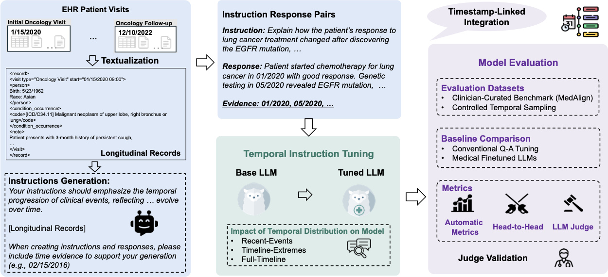

# TIMER: Temporal Instruction Modeling and Evaluation for Longitudinal Clinical Records

## Introduction

TIMER⌛️ is a temporal instruction modeling and evaluation framework designed to enhance large language models' ability to reason over longitudinal clinical records. Despite recent advances in LLMs' ability to process long contexts, they continue to struggle with temporal reasoning across patient timelines—a critical capability for clinical applications.



TIMER addresses fundamental challenges in processing longitudinal medical records by:
- Grounding LLMs in patient-specific temporal contexts through timestamp-linked instruction-response pairs
- Ensuring temporal fidelity throughout the training process
- Improving models' ability to synthesize information across multiple timepoints


## Installation 
Create a conda environment from the enviornment conda file:
-`conda env create -f environment.yml`

## Module 1: TIMER Instruction Tuning and TIMER-Eval Data Generation
The scripts for instructional data generation are located in the `timer/instruct_gen/` folder.

The instructional generation pipeline is composed of several steps.

#### Step 1: Patient Sampling 

`sample_patients.py` connects with the BigQuery Table and IID sample a set of patient IDS. Example commands:

```Bash
python sample_patients.py --sampling_method random  --sample_n 5
```

#### Step 2: Instruction Generation with EHR + Prompts

`generator.py` uses the async io to call the API and generate the instruction set, based on the materialized ehr records. The generation is based on a context window of 16k. 

#### Step 3: Formatting json instruction-response pairs + EHR files
`python alpaca_format.py`: Parse the generated jsons and convert the synthetic instruction-response pairs into the format of Alpaca instructions (more details refer to [alpaca_data.json](https://github.com/tatsu-lab/stanford_alpaca?tab=readme-ov-file#data-release)):
- Specify where the instruction json is located (Currently we support json formatted instruction-response pairs with the EHR ID as the file name)
- Specify where the reformatted data should be saved to
- Specify where the EHR files can be found (Currently we support one jsonl file with entries containing `uid` to indicate EHR ID and match to instruction file name).
- Specify what model's tokenizer you will be using in training. This is to ensure that we truncate the retrieved EHR to fit within the context length of the model that will be instruction-tuned.
- Specify the context length for truncating EHR IF AND ONLY IF we are doing naive chunking
```Bash
# parse LLM generated response and convert the instruction set to alpaca format for SFT
python alpaca_format.py --instruction_folder {TODO} --output_folder {TODO} --ehr_data_path {TODO} --context_length {TODO}
```
Alternatively, check out the file `alpaca_format.sh` for all default arguments and paths.

The output JSON file `./data/ehr_data.json` is a list of dictionaries, each dictionary contains the following fields:

- `instruction`: str, generated tasks on what the model should perform. Each instruction is unique.
- `input`: str, context or input for the task. Here we put the EHR records as the ground of the instruction-response pairs.
- `output`: str, the answer to the instruction.

We will use the following prompts for model fine-tuning:
```
Below is an instruction that describes a task, paired with an input that provides further context. Write a response that appropriately completes the request.

### Instruction:
{instruction}

### Input:
{input}

### Response:
```

## Module 2: Temporal Selection
The scripts for instruction-response pairs selection is located in the `timer/instruct_select/` folder
The script `temporal_selection.py` supports sampling instruction sets that follow different temporal distributions: `Recency-focused`, `Edge-focused`, and `Uniformly distributed`. The script `balanced_bench_sampling.py` performs subset sampling that follows a uniform distribution.

## Module 3: Instruction-Tuning (IFT)
The code for model instruction-tuning is located in the `timer/instruct_tune/` folder.

`instruct_tune/tune_llama_recipes.py`: instruct-tune Llama-3 with the generated instruction set and include short context validation on MMLU college medicine and clinical knowledge benchmarks.

The fine-tuned model will be saved in the `--output_dir` folder (which is `./models` folder under your project path) for inference and evaluation. The hyperparameters were found via wandb sweep to be optimal for our current set-up.

To change the base model which we perform PEFT fine-tuning on, simply update the `--model_name` parameter. To use wandb, add `--use_wandb` to the parameters. You'll need to log in to wandb. You can do this by running `wandb login` and then entering your API key when prompted. The entity and project is set up in the script. 


## Module 4: Evaluation
The code for evaluation is located in the `timer/evaluate/` folder.

### MedAlign preprocessing, inference and evaluation
To evaluate both fine-tuned and baseline models on MedAlign, we can use the following code.

#### Preprocessing
You will need to first preprocess the MedAlign instruction, response, EHR triplets for future inference such that it has the correct context length and generation length parameters.

#### Inference
In inference, the command line argument of `--enable_lora` differentiates between baselines and fine-tuned models. If you want to run a fine tuned model, you turn on this flag as well as `--lora_path` where you then point to the generated model checkpoint from the SFT stage. the `--path_to_prompts` argument points to the preprocessed output from the above "Preprocessing" step. The output of this command can be used for NLP evaluations, LLM-as-judge evaluations, and DocLens evaluations.

### NLP Evaluation
For NLP evaluation of MedAlign output, you will need to ensure that you have access to where the reference answers are. We will use these reference answers to compare to the generated responses from Inference above.

### LLM-as-Judge
This guide explains how to generate `correctness` and `completeness` metrics using the LLM-as-Judge evaluator.

#### Directory Setup

Place your model responses and reference materials under the `result/` directory with the following structure:

First, put all your model's responses and the reference responses under `result/`. We will also needs `clinician-instruction-responses.csv` which contains the reference response for each instruction in MedAlign and `full_patient_ehrs/*` which include the relevant EHRs for the instructions. 

Required files/args:
- `clinician-instruction-responses.csv`: Reference responses for MedAlign instructions
- `full_patient_ehrs/*`: Relevant EHRs for the instructions
- model generated responses in CSV format

#### Running the Evaluator
```bash
./run_judge.sh
```

### Head-to-Head Eval
We offer an alternative method for head-to-head evaluation, where a judge compares two model responses to determine which is better by referencing the reference answer.

#### Running the Head-to-Head Evaluator
To compare model responses from `model_a` and `model_b`, use the following command:

```bash
python head_to_head_eval.py   --model_a_responses ../result/baseline/test_A_response.csv   --model_b_responses ../result/baseline/test_B_response.csv    --output_file ../result/head_to_head/{model_a}_{model_b}.json
```
In this command:
- `--model_a_responses`: Path to the CSV file containing responses from model A.
- `--model_b_responses`: Path to the CSV file containing responses from model B.
- `--reference_answers`: Path to the CSV file containing the reference answers.
- `--output_file`: Path where the results of the head-to-head evaluation will be saved, with `{model_a}` and `{model_b}` replaced by the actual model names.

<!-- ## Experiments -->

<!-- ### Main Results
We evaluate TIMER on both human-annotated and model-generated benchmarks:  
📈 +7.3% improvement on physician-generated MedAlign benchmark  
📈 +9.2% improvement on temporal reasoning on TIMER-Eval   


### "Lost-in-the-Middle" Effect 
Text generation conditioned on a long-context input demonstrates a lost in the middle effect– indicating that we need to consider how we sample from our distribution for full longitudinal coverage. 

<p align="center">  
    
    <!-- Text. -->
<!-- </p>

### Impact of Temporal Distribution Strategies 
To evaluate the impact of different temporal distribution strategies for instruction tuning on EHR reasoning tasks, we conducted evaluations on 
benchmarks with three different temporal distributions: (1) the human-annotated benchmark MedAlign which shows a recency-focused distribution, (2) an edge-focused TIMER-Eval where evaluation instruction-response pairs are randomly sampled from the natural model-generated distribution and (3) a uniform-distributed TIMER-Eval where the evaluation instruction-response pairs are sampled with equal frequency across all patient visits. --> -->

<!--  -->

## Acknowledgments
We thank [llama-cookbook](https://github.com/meta-llama/llama-cookbook) for open-sourcing the model training frameworks that we used in this work.

## License
MIT License

Copyright (c) 2025 TIMER Authors

Permission is hereby granted, free of charge, to any person obtaining a copy
of this software and associated documentation files (the "Software"), to deal
in the Software without restriction, including without limitation the rights
to use, copy, modify, merge, publish, distribute, sublicense, and/or sell
copies of the Software, and to permit persons to whom the Software is
furnished to do so, subject to the following conditions:

The above copyright notice and this permission notice shall be included in all
copies or substantial portions of the Software.

THE SOFTWARE IS PROVIDED "AS IS", WITHOUT WARRANTY OF ANY KIND, EXPRESS OR
IMPLIED, INCLUDING BUT NOT LIMITED TO THE WARRANTIES OF MERCHANTABILITY,
FITNESS FOR A PARTICULAR PURPOSE AND NONINFRINGEMENT. IN NO EVENT SHALL THE
AUTHORS OR COPYRIGHT HOLDERS BE LIABLE FOR ANY CLAIM, DAMAGES OR OTHER
LIABILITY, WHETHER IN AN ACTION OF CONTRACT, TORT OR OTHERWISE, ARISING FROM,
OUT OF OR IN CONNECTION WITH THE SOFTWARE OR THE USE OR OTHER DEALINGS IN THE
SOFTWARE.
